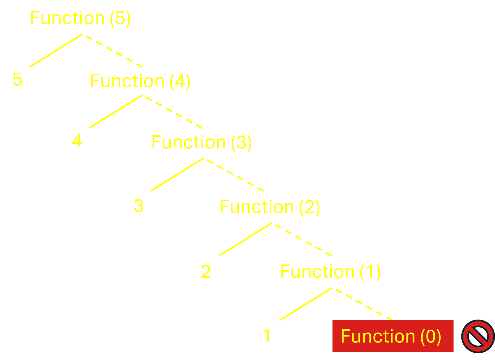
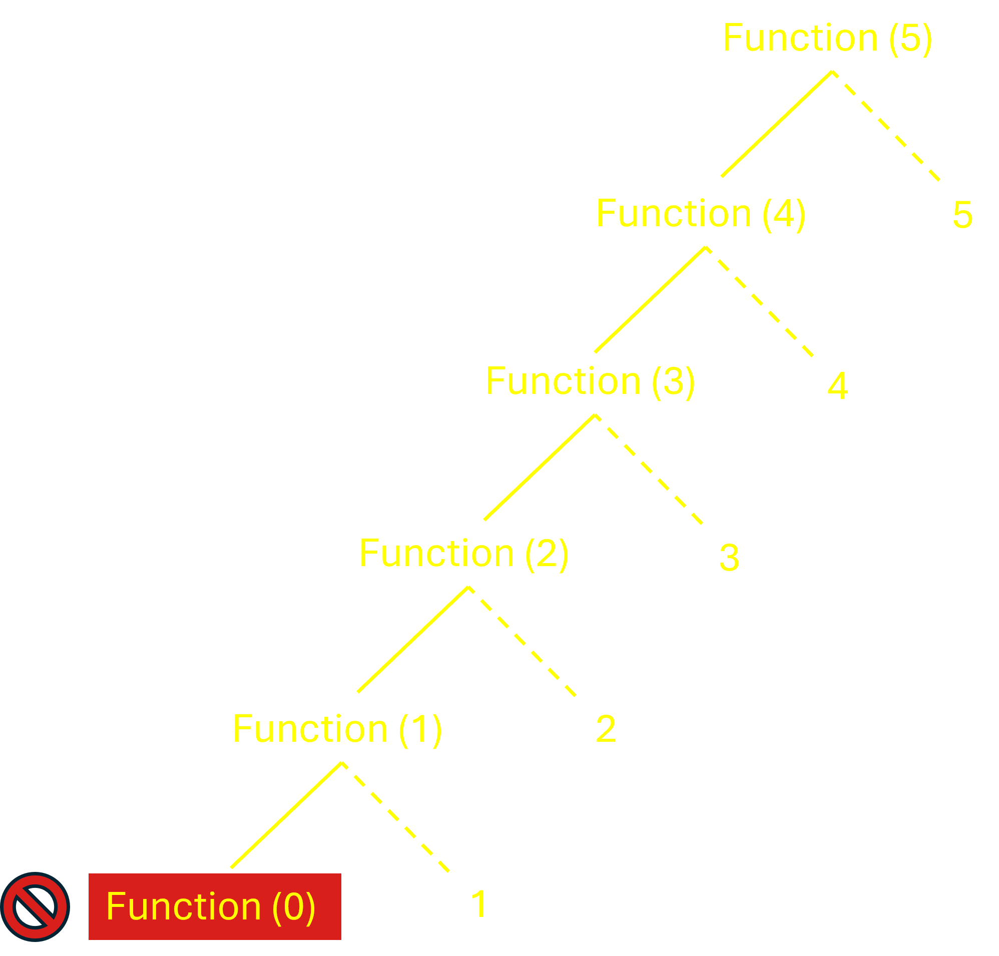
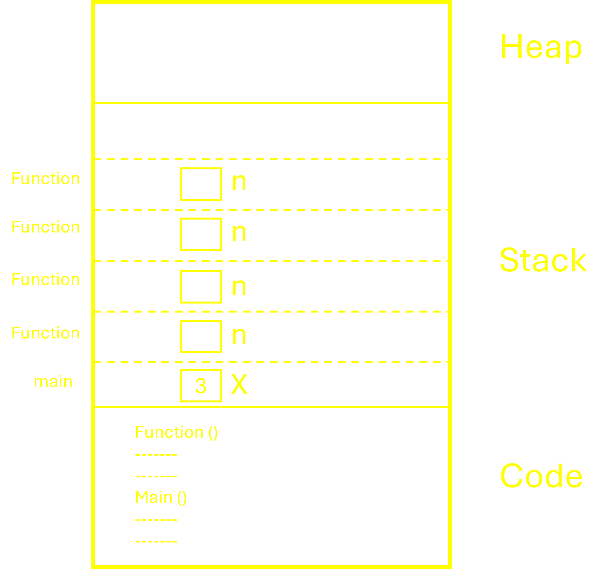
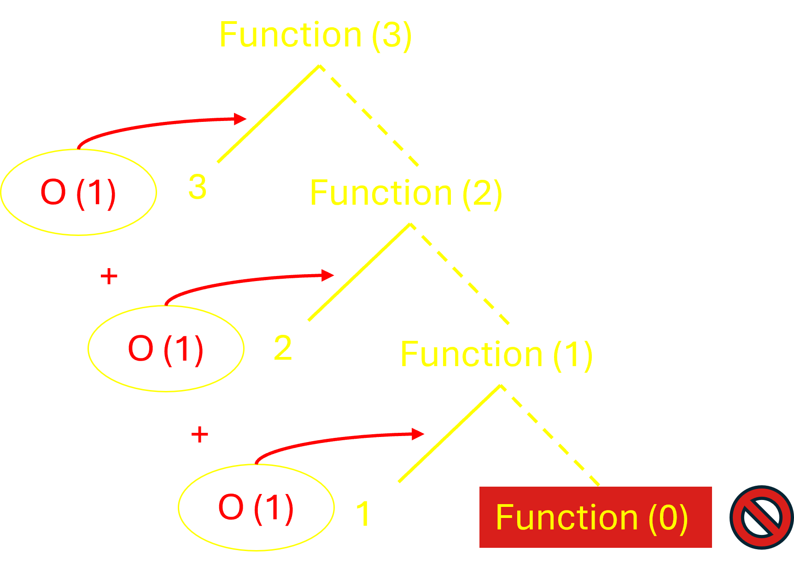
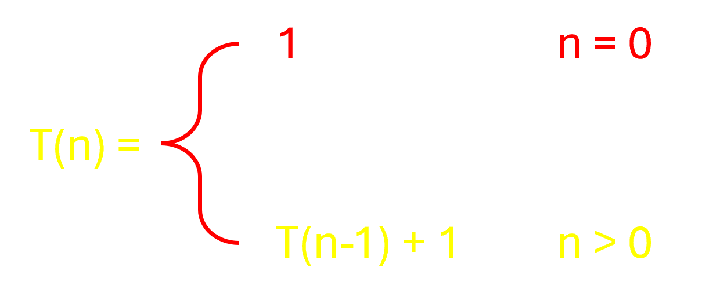
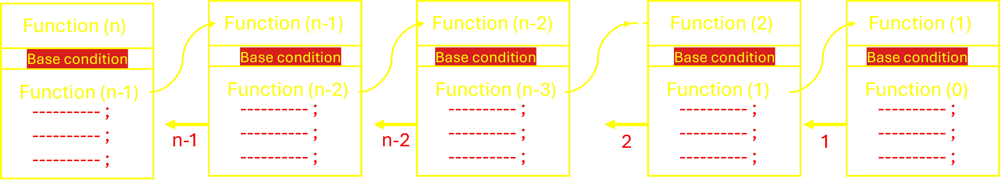
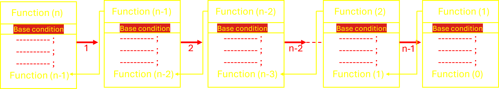
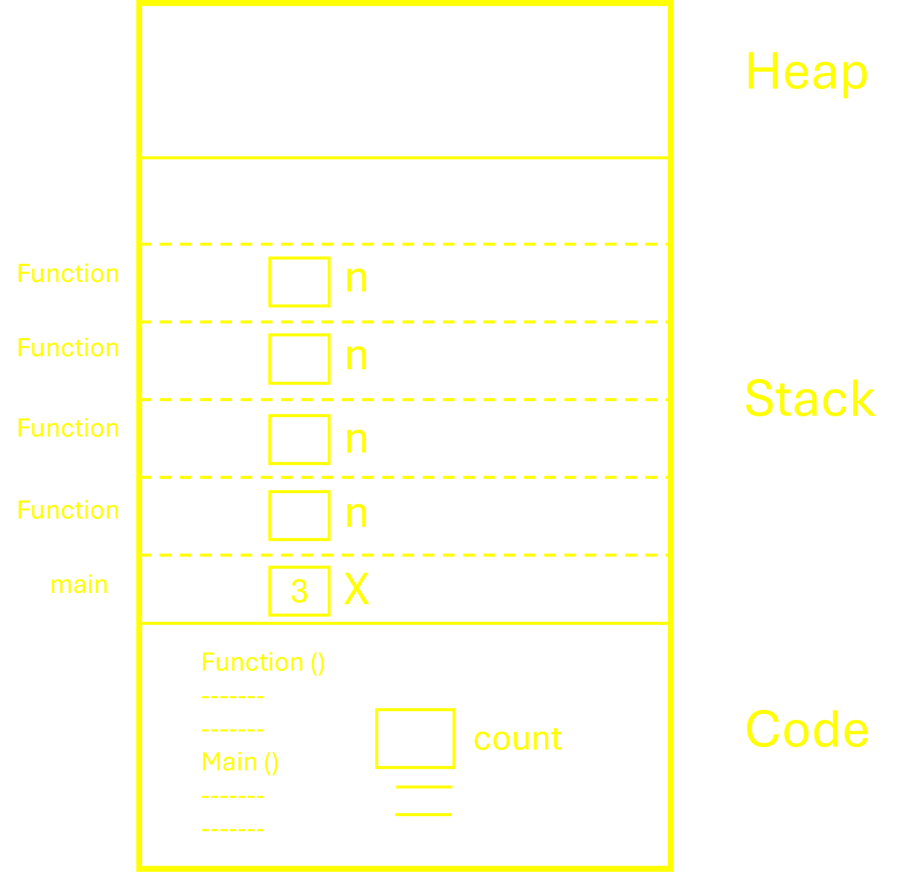

# Recursion : _Inception of code..._

Recursion is a programming technique where a function calls itself directly or indirectly in order to solve a problem. It's akin to a concept in "Inception," where dreams within dreams occur, except here, it's functions calling themselves!

&nbsp;&nbsp;&nbsp;&nbsp;&nbsp;&nbsp;&nbsp;&nbsp;&nbsp;&nbsp;&nbsp;&nbsp;&nbsp;&nbsp;&nbsp;&nbsp;&nbsp;&nbsp;&nbsp;&nbsp;&nbsp;&nbsp;&nbsp;&nbsp;&nbsp;&nbsp;&nbsp;&nbsp;&nbsp;&nbsp;&nbsp;&nbsp;&nbsp;&nbsp;&nbsp;&nbsp;&nbsp;&nbsp;&nbsp;&nbsp;&nbsp;&nbsp;&nbsp;&nbsp;&nbsp;&nbsp;

## What is Recursion ?

- A function calling itself is called recursion.
- There must be a base condition that will terminate the recursion
otherwise it will go into infinite loop.

### Syntax

```cpp
Type fun (parameters) {
    // body of function
    if( <base condition> ) {
        .......
        fun (parameters)
        .......
    }
}
```

Example 1 :

```cpp
void function (int n) {

    if (n>0) {

        printf("%d", n );  // first printing 
        function (n-1); // then recursive call
    }
}

void main() {
 int x = 5;
 function (x);
}
```

output:

```cpp
5 4 3 2 1
```

Explanation :

- The function is called with the value 5.
- The value of n is 5, so the condition is true.
- The function prints 5 and then calls itself with the value 4.
- The value of n is 4, so the condition is true.
- The function prints 4 and then calls itself with the value 3.
- The value of n is 3, so the condition is true.
- The function prints 3 and then calls itself with the value 2.
- The value of n is 2, so the condition is true.
- The function prints 2 and then calls itself with the value 1.
- The value of n is 1, so the condition is true.
- The function prints 1 and then calls itself with the value 0.
- The value of n is 0, so the condition is `false`.

&nbsp;&nbsp;&nbsp;&nbsp;&nbsp;&nbsp;&nbsp;&nbsp;&nbsp;&nbsp;&nbsp;&nbsp;&nbsp;&nbsp;&nbsp;&nbsp;&nbsp;&nbsp;&nbsp;&nbsp;&nbsp;&nbsp;&nbsp;&nbsp;&nbsp;&nbsp;&nbsp;&nbsp;&nbsp;&nbsp;&nbsp;

Example 2 :

```cpp
void function (int n) {

    if (n>0) {

        function (n-1); // first recursive call
        printf("%d", n );  // then printing 
        
    }
}

void main() {
 int x = 5;
 function (x);
}
```

output:

```cpp
1 2 3 4 5
```

Explanation :

- The function is called with the value 5.
- The value of n is 5, so the condition is true.
- then calls itself with the value 4.
- The value of n is 4, so the condition is true.
- and then calls itself with the value 3.
- The value of n is 3, so the condition is true.
- then calls itself with the value 2.
- The value of n is 2, so the condition is true.
- then calls itself with the value 1.
- The value of n is 1, so the condition is true.
- then calls itself with the value 0.
- The value of n is 0, so the condition is `false`.

&nbsp;&nbsp;&nbsp;&nbsp;&nbsp;&nbsp;&nbsp;&nbsp;&nbsp;&nbsp;&nbsp;&nbsp;&nbsp;&nbsp;&nbsp;&nbsp;&nbsp;&nbsp;&nbsp;&nbsp;&nbsp;&nbsp;&nbsp;&nbsp;&nbsp;&nbsp;&nbsp;&nbsp;&nbsp;&nbsp;&nbsp;

&nbsp;

## Generalization of  Recursion

Recursive Function have 2 Phases :

1. __Ascending Phase (Winding Phase)__ : `Before Base condition meet`

    - This phase occurs when the function calls itself with modified parameters or arguments.
    - In terms of the call stack, this phase involves pushing new function calls onto the stack as the recursion deepens.

&nbsp;

2. __Descending Phase (Unwinding Phase)__ : `After Base condition meet`

    - This phase occurs when the base case condition is met, and the function starts to return values back up through the call stack.

    - It involves popping function calls from the stack as each recursive call returns its result.

&nbsp;

### Generalized format

```cpp
void function (int n) {

    if (Base Condition) {

            Ascending Phase -  1. .......... // Calling

            recursive call     2. function (n-1); // recursive call

            Descending Phase - 3. .......... // Returning 

        }

    }

```

&nbsp;

### Difference between Recursion and Loop

- The difference is a `loop` will have `only ascending phase`
- But the `recursion` will have `both ascending as well as descending phases`.
- That is the strength and power of recursion that you can utilize or exploit for writing code easier.

&nbsp;

### Recursion vs Iteration

- Recursion is a technique of solving a problem by dividing it into smaller subproblems.

- Iteration is a technique of solving a problem by repeating a set of instructions until a condition is
met.

&nbsp;

### How Recursion Uses Stack

- When a function is called, it is pushed onto the stack.
- When the function returns, it is popped off the stack.
- The stack is used to keep track of the function calls and their return addresses.

Example :

&nbsp;&nbsp;&nbsp;&nbsp;&nbsp;&nbsp;&nbsp;&nbsp;&nbsp;&nbsp;&nbsp;&nbsp;&nbsp;&nbsp;&nbsp;&nbsp;&nbsp;&nbsp;&nbsp;&nbsp;&nbsp;&nbsp;&nbsp;&nbsp;&nbsp;&nbsp;&nbsp;&nbsp;&nbsp;&nbsp;&nbsp;
&nbsp;

### Time Complexity of Recursion

- The time complexity of a recursive function depends on the number of recursive calls made and the time taken
to execute each call.
- We assume that every statement in our program takes one unit of time for execution.

Example  :

```cpp
void function (int n) { 

    if (n>0) {

        printf("%d", n );   // Unit time - 1
        function (n-1);     
    }
}
```

&nbsp;&nbsp;&nbsp;&nbsp;&nbsp;&nbsp;&nbsp;&nbsp;&nbsp;&nbsp;&nbsp;&nbsp;&nbsp;&nbsp;&nbsp;&nbsp;&nbsp;&nbsp;&nbsp;&nbsp;&nbsp;&nbsp;&nbsp;&nbsp;&nbsp;&nbsp;&nbsp;&nbsp;&nbsp;&nbsp;&nbsp;

- As you can see in the above tracing tree, first it prints the value 3, then print 2 and then print the value 1. That means the printf statement `executed three times`. So, this recursive function will take 3 units of time to execute when the n value is 3.

- If we make the n value is 5 then it will take 5 units of time to execute this recursive function.

- The time can be represented as the order of n i.e. `O(n)`. The time taken is in order of `n`.

&nbsp;

### Time Complexity using Recurrence Relation :

- The time complexity of a recursive function can be calculated using the following formula:

### T(n) = a * T(n/b) + f(n)

where:\
`T(n)` is the time complexity of the function \
`a` is the number of recursive calls made\
`b` is the Size Reduction Factor \
`f(n)` is the time taken to execute each call

&nbsp;

Same Example  :

```cpp
void function (int n) { // T(n)

    if (n>0) {

        printf("%d", n );   // Unit time - 1
        function (n-1);     // T(n-1)
    }
}
```

Here, 
- `a = 1`, . . . . . .  there is only one recursive call to `function(n-1)`.\
- `b = 1` ,. . . . . .  Since n is reduced to n−1, it is equivalent to `n÷1`, meaning b=1\
- `f(n)= 1` . . . . . . The cost of the `additional work done outside the recursive calls`, in this case, is the `printf` statement which takes O(1) time.


&nbsp;
### Induction Method or Successive Substitution method :

Same Example  :

```cpp
void function (int n) { // T(n)

    if (n > 0) {

        printf("%d", n );   // Unit time - 1
        function (n-1);     // T(n-1)
    }
}
```
&nbsp;&nbsp;&nbsp;&nbsp;&nbsp;&nbsp;&nbsp;&nbsp;&nbsp;&nbsp;&nbsp;&nbsp;&nbsp;&nbsp;&nbsp;&nbsp;&nbsp;&nbsp;&nbsp;&nbsp;&nbsp;&nbsp;&nbsp;&nbsp;&nbsp;&nbsp;&nbsp;&nbsp;&nbsp;&nbsp;&nbsp;

- Base Case : `T(0) = 1 `
- Induction Hypothesis : `T(n) = 1 + T(n-1)`
- Induction Step : \
T(n) = 1 + T(n-1)\
= 1 + (1 + T(n-2))= 2 + T(n-2)\
= 1 + (1 + (1 + T(n-3))) = 3 + T(n-3)\
= 1 + (1 + (1 + (1 + T(n-4)))) =
4 + T(n-4)\
= 1 + (1 + (1 + (1 + (1 + T(n-5
)))) = 5 + T(n-5)\
= 1 + (1 + (1 + (1 + (1 + (1 + T
(n-6)))) = 6 + T(n-6)\
= 1 + (1 + (1 + (1 + (1 + (1 + (
    1 + T(n-7)))) = 7 + T(n-7)\
    `T(n)=T(n-k) + k`

    If n==k,\
    `T(n)=T(n-n) + n`\
    `T(n)=T(0) + n`\
    `T(n)=1 + n`

    Conclusion : `T(n) = 1 + n`


&nbsp;

### Space Complexity of Recursion

- The space complexity of a recursive function depends on the number of recursive calls made and the space taken
by each call.
- We assume that every statement in our program takes one unit of space for execution.
- The space complexity of a recursive function can be represented as the order of n i.e. `O(n)`. The space taken is in order of `n`

&nbsp;

## :computer: :coffee:    Lets code Recursion :repeat:

### 1. Head Recursion : `if the recursive call is made first`

Example : [Try here](Head%20Recursion.cpp)
```cpp
void function(int n) {
    if (n > 0) {

        function(n - 1);  // Head recursion

        printf("%d ", n);
    }
}
```

output :
``` mathematica
1 2 3 4 5 
```
&nbsp;


&nbsp;

### 2. Tail Recursion : `if the recursive call is made last`

Example : [Try here](Tail%20Recursion.cpp)
```cpp
void function(int n) {
    if (n > 0) {

        printf("%d ", n);

        function(n - 1);  // Tail recursion
    
    }
}
```

output :
``` mathematica
5 4 3 2 1
```
&nbsp;


&nbsp;

## Local, Static and Global Variable in Recursion :

### Local Variable : 

- Scope: Local to the function or block in which they are defined.
- Lifetime: From the point of declaration to the end of the block in which they are declared.
- Storage: Automatic storage (stack).

Example : [Try here](Local%20Variable.cpp)

Here every time when function is called, a new copy of variable `n` is created....
```cpp
#include <stdio.h>
int fun (int n)
{
    if (n > 0)
    {
        return fun (n-1) + n;
    }
    return 0;
}

int main ()
{
    int a = 3;
    printf ("%d", fun(a));
    return 0;
}
```
Output :
```
6
```
&nbsp;

&nbsp;&nbsp;&nbsp;&nbsp;&nbsp;&nbsp;&nbsp;&nbsp;&nbsp;&nbsp;&nbsp;&nbsp;&nbsp;&nbsp;&nbsp;&nbsp;&nbsp;&nbsp;&nbsp;&nbsp;&nbsp;&nbsp;&nbsp;&nbsp;&nbsp;&nbsp;&nbsp;&nbsp;&nbsp;&nbsp;&nbsp;

&nbsp;

### Static Variable :

- Scope: Local to the function or block in which they are defined.
- Lifetime: From the point of declaration to the end of the program.
- Storage: Static storage (heap).
- `Initialized to zero if not initialized explicitly`.
- `Initialized only once, even if the function is called multiple times`.

Example : 
[Try here](Static%20Variable.cpp)

```cpp
#include <stdio.h>
int fun (int n)
{
    static int count = 0 ; // auto initialized as 0
    if (n > 0)
    {
        count++;
        return fun (n-1) + count;
    }
    return 0;
}

int main ()
{
    int X = 3;
    printf ("%d", fun(X));
    return 0;
}
```
Output :
```
9
```

&nbsp;
&nbsp;&nbsp;&nbsp;&nbsp;&nbsp;&nbsp;&nbsp;&nbsp;&nbsp;&nbsp;&nbsp;&nbsp;&nbsp;&nbsp;&nbsp;&nbsp;&nbsp;&nbsp;&nbsp;&nbsp;&nbsp;&nbsp;&nbsp;&nbsp;&nbsp;&nbsp;&nbsp;&nbsp;&nbsp;&nbsp;&nbsp;
&nbsp;

> 

`Question` : For every call we are assigning count = 0, then how come it is incrementing with previous value ?\
`Answer` : It’s a static variable it will not be initialised to 0 every time.

### Global Variable :
- Scope: Global to the entire program.
- Lifetime: From the point of declaration to the end of the program.
- Storage: Static storage (heap).
- `Initialized to zero if not initialized explicitly`
- `Initialized only once, even if the function is called multiple times`
- `Can be accessed by any function in the program`
- Can be declared as `const` to make it read-only
- Can be declared as `volatile` to make it read-only
- Can be declared as `extern` to make it accessible from other files
- Can be declared as `static` to make it accessible only within the file in which it
is declared`
- Can be declared as `register` to make it accessible only within the file in which it is declared`

Example : 
[Try here](Global%20Variable.cpp)

```cpp
#include <stdio.h>

int count;  // auto initialized as 0
int fun (int n)
{
    if (n > 0)
    {
        count++;
        return fun (n-1) + count;
        }
        return 0;
            
}
int main ()
{
    printf ("%d\n", fun (3));
    return 0;
}
```
Output :
```
9
```
&nbsp;


## Types of Recursion :
Recursion can be classified into several types `based on how the recursive calls are made and the structure of the recursion`. 

Here are the Main types of recursion:


- [Tail recursion](#tail-recursion-)
- [Head recursion]()
- [Tree recursion]()
- [Indirect recursion]()
- [Nested recursion]()

&nbsp;

### Tail Recursion : 
- `No execution at returning`

- In tail recursion, the `recursive call is the last statement` in the function.

- After that call there is nothing, it is not performing anything, so, it is called tail recursion.

- The compiler can optimize tail recursion to `avoid stack overflow` by replacing the recursive call with a `loop` or `goto` statement.

Example : [Try here](Tail%20Recursion.cpp)
```cpp
int fun (int n)
{
    if (n > 0)
    // 
    // tail recursion
    //
    //
    return fun (n-1) ; // no execution after call
}
```
&nbsp;

>[!NOTE]
> The following example is not Tail Recursion.
 ```cpp
 int fun (int n)
 {
     if (n > 0)
     {
         cout << n << endl;
         fun(n-1) + n; ;   // execution after call while returning 
     }
 }
```
> As you can see in the below example, there is something written (+n) along with the function call i.e. some operation is going to be performed at the returning time. So, in this function, there is something remaining that has to be performed at returning time and hence cannot be tail recursion. Tail recursion means at returning time it doesn’t have to perform anything at all.

&nbsp;

### Tail recursion v/s Loop :
- Tail recursion is a `recursive function` that can be replaced by a `loop` or `goto` statement.

Example for same output : 

```cpp
    // Loop                          // Tail Recursion
                             | 
void fun(int n)              |        void fun(int n)
{                            |        {
    while (n > 0)            |            if (n > 0)
    {                        |            {
        printf("%d", n);     |                 printf("%d", n);
        n--;                 |                 fun(n-1);
    }                        |            }
}                            |        }

                    // Output: 5 4 3 2 1

Time Complexity = O(n)                  Time Complexity = O(n)
Space Complexity = O(1)                 Space Complexity = O(n)
```
    


